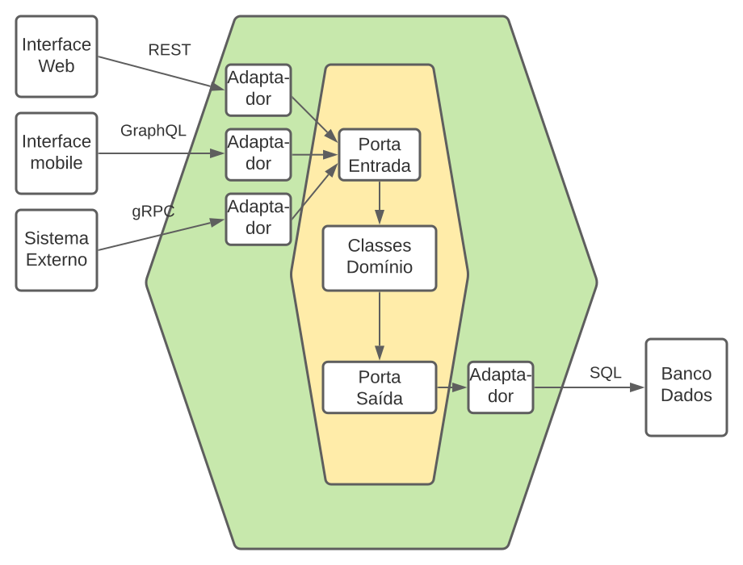

## Projeto com arquitetura hexagonal em Java/Spring boot

    Esse projeto foi desenvolvido com intuito acadêmico, 
    com base na arquitetura hexagonal aprendida. Abaixo vou deixar uma imagem
    que explica um pouco sobre essa arquitetura.

    Tecnologias utilizadas nesse desenvolvimento:

